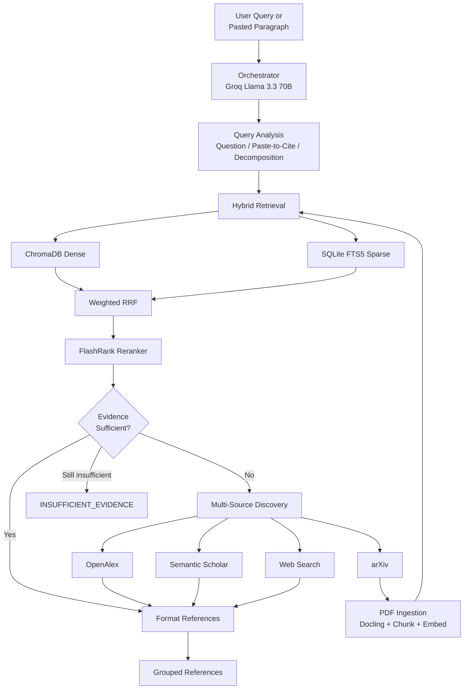

# Active Research Assistant

An **agentic hybrid-retrieval RAG pipeline** for academic literature discovery, layout-aware PDF ingestion, persistent indexing, and **citation-ready reference output**.

Unlike static RAG systems that only search a fixed corpus, this assistant can **discover new papers and web sources**, ingest arXiv PDFs during a session, re-run retrieval, and return formatted references grouped by source — or explicitly report when evidence is insufficient. Paste a paragraph to get per-claim citations, or ask a research question to discover academic and web sources.

For the full engineering specification, see [AGENTS.md](./AGENTS.md).

---

## Features

- **Hybrid retrieval** — ChromaDB dense search + SQLite FTS5 (BM25), fused with weighted RRF
- **Cross-encoder reranking** — FlashRank (`ms-marco-MiniLM-L-12-v2`) on CPU
- **Evidence sufficiency gate** — triggers active discovery when local retrieval confidence is too low
- **Multi-source discovery** — arXiv, OpenAlex, Semantic Scholar, and web search (DuckDuckGo)
- **Paste-to-cite** — paste a paragraph; the system splits it into focused search queries per claim/sentence
- **Corporate query routing** — vendor/enterprise queries (e.g. ServiceNow) prioritize web discovery and skip irrelevant arXiv ingestion
- **Grouped references** — top relevant citation per source, in MLA/APA/IEEE/Harvard/Chicago styles
- **Web & corporate citations** — documentation pages cite as author–date, e.g. `(ServiceNow, 2023)`
- **References-only output** — returns formatted bibliographies (no LLM synthesis by default)
- **Local web UI** — FastAPI app with query history, cancel, copy/download, and fast mode
- **Layout-aware ingestion** — Docling parsing with section-aware chunking and structured metadata
- **Gemini API key rotation** — automatic fallback across keys on rate limits (429 / quota)
- **Cooperative cancellation** — stop in-flight requests from the UI or CLI
- **Token efficiency** — query-analysis cache, simple-query heuristics, passage truncation
- **Transactional indexing** — dual writes to ChromaDB + FTS5 with rollback on failure
- **Download security** — HTTPS-only, domain allowlist, path traversal protection, PDF validation

---

## How It Works



**Core invariant:** no verified evidence → no unsupported technical claim.

**Discovery notes:**
- **arXiv** — PDFs are downloaded, parsed, and indexed locally
- **OpenAlex / Semantic Scholar** — metadata citations; arXiv-linked papers may still be ingested
- **Web** — citation metadata only (vendor docs, product pages, etc.); not ingested into the index
- **Corporate queries** — routes to web + academic metadata; skips arXiv PDF ingestion for vendor/product topics
- **Pasted prose** — decomposed into 2–4 short search queries (one per sentence/claim) for better citation accuracy

---

## Requirements

- Python **3.11+**
- [Groq API key](https://console.groq.com/) — query analysis and orchestration
- [Google AI Studio API key](https://aistudio.google.com/) — Gemini embeddings
- ~2 GB disk for Docling layout models (downloaded on first PDF parse)
- Internet access for discovery APIs and web search

---

## Installation

```bash
git clone https://github.com/MHOC96/Active-Research-Assistant-Agent-.git
cd Active-Research-Assistant-Agent-

python -m venv .venv

# Windows
.venv\Scripts\activate

# macOS / Linux
source .venv/bin/activate

pip install -e ".[dev]"
```

Copy the environment template and add your API keys:

```bash
# Windows
copy .env.example .env

# macOS / Linux
cp .env.example .env
```

---

## Configuration

All settings load from `.env`. Key variables:

| Variable | Description |
|---|---|
| `GROQ_API_KEY` | Groq Cloud API key for query analysis |
| `GOOGLE_API_KEY` | Primary Gemini embedding API key |
| `GOOGLE_API_KEYS` | Comma-separated fallback keys for rate-limit rotation |
| `GEMINI_EMBEDDING_MODEL` | Default: `gemini-embedding-001` (768-dim) |
| `MIN_RERANK_SCORE` | Sufficiency threshold (default: `0.70`) |
| `DISCOVERY_SOURCES` | Comma-separated sources (default: `arxiv,openalex,semantic_scholar,web`) |
| `DISCOVERY_PER_SOURCE_MAX` | Top hits per source (default: `1`) |
| `MAX_NEW_DOCUMENTS_PER_QUERY` | Cap on arXiv PDFs ingested per query (default: `3`) |
| `MAX_DISCOVERY_ROUNDS` | Max discovery loops (default: `2`) |
| `OPENALEX_MAILTO` | Email for OpenAlex polite pool (recommended) |
| `SEMANTIC_SCHOLAR_API_KEY` | Optional Semantic Scholar API key |
| `CITATION_STYLE` | Default output style (default: `mla9`) |
| `MAX_SUBQUERIES` | Max decomposed queries for complex/pasted input (default: `5`) |
| `SKIP_QUERY_LLM_FOR_SIMPLE` | Skip Groq for short questions (default: `true`) |

See [`.env.example`](./.env.example) for the complete list.

### Discovery source examples

```env
# All sources (default)
DISCOVERY_SOURCES=arxiv,openalex,semantic_scholar,web

# Academic papers only
DISCOVERY_SOURCES=arxiv,openalex,semantic_scholar

# Web / corporate documentation only
DISCOVERY_SOURCES=web
```

List available citation styles:

```bash
research-assistant --list-citation-styles
```

> **Never commit `.env` or API keys to source control.**

---

## Usage

### Validate setup

```bash
research-assistant --check-config
research-assistant --check-config --validate
```

### Local web UI (recommended)

```bash
pip install -e .
research-assistant-ui
```

Open **http://127.0.0.1:7860** in your browser.

The UI includes:
- Citation style selection (MLA, APA, IEEE, etc.)
- Fast mode for quicker first results
- Query history with cached results (click to reload, select/remove entries)
- Cancel in-flight requests
- Copy and download formatted references

### Paste a paragraph to cite

Paste multi-sentence prose (not a question) to find sources for each claim:

```bash
research-assistant --citation-style apa7 "Cloud computing architectures rely on containerization to package applications with their complete runtime dependencies. Container engines enable horizontal scaling compared to virtualization. Orchestration frameworks handle rolling updates and self-healing."
```

The pipeline detects pasted prose, extracts focused search queries per sentence, and returns grouped references from all discovery sources. Low-relevance indexed hits are filtered out automatically.

### Ask a research question (CLI)

```bash
research-assistant "How does transformer self-attention work?"
```

With pipeline logging:

```bash
research-assistant --verbose "Compare RAG and GraphRAG on latency and hallucination rate"
```

Speed mode (target ~1 minute when ingesting **one** new paper):

```bash
research-assistant --fast --citation-style apa7 "Compare RAG and GraphRAG"
```

Cite corporate or vendor documentation:

```bash
research-assistant --citation-style apa7 "ServiceNow ITSM multi-instance architecture"
```

### CLI options

| Flag | Description |
|---|---|
| `--check-config` | Print configuration and validate env vars |
| `--validate` | With `--check-config`, probe Groq and Gemini APIs |
| `--verbose` | Enable informational logging |
| `--skip-validation` | Skip startup API health checks |
| `--citation-style STYLE` | Citation format (`apa7`, `mla9`, `chicago17`, `ieee`, `harvard`, `internal`) |
| `--list-citation-styles` | List all supported citation styles |
| `--fast` | Speed mode: 1 paper, batched embeddings, lighter PDF parsing |

### Example output

References are grouped by discovery source:

```text
References

From arXiv (indexed)
Dai, Z., et al. "Transformer-XL: Attentive Language Models Beyond a Fixed-Length Context." arXiv, 2019, https://arxiv.org/abs/1809.04281.

From OpenAlex
Smith, A. "Knowledge Graph RAG." OpenAlex, 2024, https://openalex.org/W123.

From Web
ServiceNow. (2023). IT Service Management. ServiceNow. https://www.servicenow.com/products/itsm.html
In-text: (ServiceNow, 2023)
```

If no sources are found:

```text
INSUFFICIENT_EVIDENCE: No retrieved source provides verified evidence for the query.
```

### First-run behavior

On an empty index, the pipeline will:

1. Search configured discovery sources (arXiv, OpenAlex, Semantic Scholar, web)
2. Download and parse arXiv PDFs (Docling — can take several minutes)
3. Generate embeddings and build indexes
4. Re-retrieve and format references from all sources

Subsequent queries against already-ingested papers are much faster.

---

## Project Structure

```text
src/research_assistant/
├── cli.py                  # CLI entry point
├── bootstrap.py            # Component wiring
├── config.py               # Environment settings
├── orchestrator/           # Groq agent, paste-to-cite, reference formatting
├── retrieval/              # Hybrid dense + sparse retrieval, RRF
├── reranking/              # FlashRank cross-encoder
├── sufficiency/            # Evidence sufficiency gate
├── discovery/              # arXiv, OpenAlex, Semantic Scholar, web, query intent
├── ingestion/              # Download, parse, chunk, embed, index
├── pipeline/               # Active literature loop
├── storage/                # ChromaDB, FTS5, metadata store
├── embeddings/             # Gemini embeddings + key rotation
├── citations/              # Citation styles and validation
├── web/                    # FastAPI UI (static frontend + API)
├── utils/                  # Cancellation, concurrency, token efficiency
└── security/               # Path and URL guardrails

data/                       # Created at runtime (gitignored)
├── chroma_db/              # Dense vector index
├── sparse_index.db         # BM25 full-text index
├── metadata.db             # Document ingestion state
└── downloads/              # Cached PDFs

tests/                      # 123 unit and integration tests
```

---

## Testing

```bash
pytest
pytest -v tests/test_paste_to_cite.py   # run a specific module
```

---

## Tech Stack

| Component | Technology |
|---|---|
| Orchestration | Groq — `llama-3.3-70b-versatile` |
| Embeddings | Google Gemini — `gemini-embedding-001` (768-dim) |
| Dense index | ChromaDB (cosine similarity) |
| Sparse index | SQLite FTS5 (BM25) |
| Reranker | FlashRank — `ms-marco-MiniLM-L-12-v2` (local CPU) |
| PDF parsing | Docling |
| Literature discovery | arXiv API, OpenAlex, Semantic Scholar |
| Web discovery | DuckDuckGo HTML search (no API key required) |
| Web UI | FastAPI + vanilla JS |

---

## Limitations

- **References only** — returns formatted bibliographies, not synthesized answers with inline citations
- **arXiv-only ingestion** — only arXiv PDFs are downloaded and indexed; web/OpenAlex/Semantic Scholar provide citation metadata
- **Paste-to-cite** — finds sources to cite; does not verify that a source supports your exact wording
- **Web search quality** — depends on DuckDuckGo HTML results; year and publisher are inferred heuristically
- **First ingestion is slow** — Docling model download + PDF parsing + embedding
- **High rerank score ≠ guaranteed correctness** — always verify citations against sources
- **Rate limits** — heavy ingestion can hit Gemini quotas; use `GOOGLE_API_KEYS` for rotation; Semantic Scholar may rate-limit without an API key
- **Windows** — Docling requires torch compile disabled (handled automatically in `parser.py`)

---

## Development Phases

All five core phases are implemented on `main`, plus UI and multi-source discovery:

| Phase | Scope |
|---|---|
| 1 | Foundation — models, storage, RRF, sufficiency gate, citation validation |
| 2 | Hybrid retrieval — Gemini embeddings, FlashRank, retriever integration |
| 3 | Ingestion — secure downloader, Docling parser, chunker, transactional worker |
| 4 | Active discovery — multi-source search, deduplication, bounded discovery loop |
| 5 | Orchestrator — Groq agent, reference formatting, end-to-end CLI |
| 6+ | Web UI, cooperative cancellation, token efficiency, web/corporate citations, paste-to-cite |

---

## License

No license file is included yet. Add one before distributing or reusing this code.

---

## Contributing

1. Fork the repository
2. Create a feature branch
3. Run `pytest` before opening a pull request
4. Do not commit `.env` or API keys
