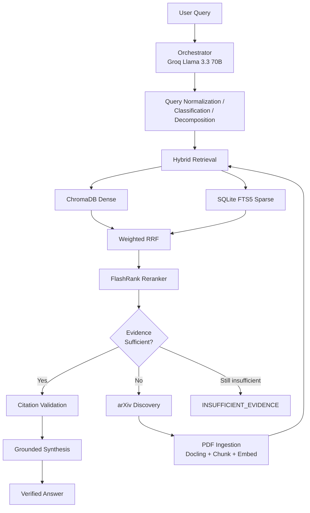

# Active Research Assistant

An **agentic hybrid-retrieval RAG pipeline** for academic literature discovery, layout-aware PDF ingestion, persistent indexing, and **citation-grounded synthesis**.

Unlike static RAG systems that only search a fixed corpus, this assistant can **discover new papers on arXiv**, ingest them during a session, re-run retrieval, and produce answers with verifiable provenance — or explicitly report when evidence is insufficient.

For the full engineering specification, see [AGENTS.md](./AGENTS.md).

---

## Features

- **Hybrid retrieval** — ChromaDB dense search + SQLite FTS5 (BM25), fused with weighted RRF
- **Cross-encoder reranking** — FlashRank (`ms-marco-MiniLM-L-12-v2`) on CPU
- **Evidence sufficiency gate** — proceeds to synthesis only when retrieval confidence is high enough
- **Active literature discovery** — searches arXiv, deduplicates, ingests PDFs, and re-retrieves
- **Layout-aware ingestion** — Docling parsing with section-aware chunking and structured metadata
- **Citation-grounded synthesis** — Groq Llama 3.3 70B with mandatory provenance tags
- **Gemini API key rotation** — automatic fallback across keys on rate limits (429 / quota)
- **Transactional indexing** — dual writes to ChromaDB + FTS5 with rollback on failure
- **Download security** — HTTPS-only, domain allowlist, path traversal protection, PDF validation

---

## How It Works



**Core invariant:** no verified evidence → no unsupported technical claim.

---

## Requirements

- Python **3.11+**
- [Groq API key](https://console.groq.com/) — orchestration and synthesis
- [Google AI Studio API key](https://aistudio.google.com/) — Gemini embeddings
- ~2 GB disk for Docling layout models (downloaded on first PDF parse)
- Internet access for arXiv discovery and API calls

---

## Installation

```bash
git clone https://github.com/MHOC96/Active-Research-Assistant-Agent-.git
cd Active-Research-Assistant-Agent-

python -m venv .venv

# Windows
.venv\Scripts\activate

# macOS / Linux
source .venv/bin/activate

pip install -e ".[dev]"
```

Copy the environment template and add your API keys:

```bash
# Windows
copy .env.example .env

# macOS / Linux
cp .env.example .env
```

---

## Configuration

All settings load from `.env`. Key variables:

| Variable | Description |
|---|---|
| `GROQ_API_KEY` | Groq Cloud API key for orchestration and synthesis |
| `GOOGLE_API_KEY` | Primary Gemini embedding API key |
| `GOOGLE_API_KEYS` | Comma-separated fallback keys for rate-limit rotation |
| `GEMINI_EMBEDDING_MODEL` | Default: `gemini-embedding-001` (768-dim) |
| `MIN_RERANK_SCORE` | Sufficiency threshold (default: `0.70`) |
| `MAX_NEW_DOCUMENTS_PER_QUERY` | Cap on papers ingested per query (default: `3`) |
| `MAX_DISCOVERY_ROUNDS` | Max arXiv discovery loops (default: `2`) |

See [`.env.example`](./.env.example) for the complete list.

> **Never commit `.env` or API keys to source control.**

---

## Usage

### Validate setup

```bash
research-assistant --check-config
research-assistant --check-config --validate
```

### Ask a research question

```bash
research-assistant "How does transformer self-attention work?"
```

With pipeline logging:

```bash
research-assistant --verbose "Compare RAG and GraphRAG on latency and hallucination rate"
```

### CLI options

| Flag | Description |
|---|---|
| `--check-config` | Print configuration and validate env vars |
| `--validate` | With `--check-config`, probe Groq and Gemini APIs |
| `--verbose` | Enable informational logging |
| `--skip-validation` | Skip startup API health checks |

### Example output

Answers include machine-verifiable citations:

```text
The transformer attention mechanism computes scaled dot-product attention
over queries, keys, and values [arXiv:1809.04281 | Chunk 6]...
```

If evidence is missing, the system returns:

```text
INSUFFICIENT_EVIDENCE: No retrieved source provides a verified latency comparison...
```

### First-run behavior

On an empty index, the pipeline will:

1. Search arXiv for relevant papers
2. Download and parse PDFs (Docling — can take several minutes)
3. Generate embeddings and build indexes
4. Re-retrieve and synthesize an answer

Subsequent queries against already-ingested papers are much faster.

---

## Project Structure

```text
src/research_assistant/
├── cli.py                  # CLI entry point
├── bootstrap.py            # Component wiring
├── config.py               # Environment settings
├── orchestrator/           # Groq agent: query analysis + synthesis
├── retrieval/              # Hybrid dense + sparse retrieval, RRF
├── reranking/              # FlashRank cross-encoder
├── sufficiency/            # Evidence sufficiency gate
├── discovery/              # arXiv search and paper selection
├── ingestion/              # Download, parse, chunk, embed, index
├── pipeline/               # Active literature loop
├── storage/                # ChromaDB, FTS5, metadata store
├── embeddings/             # Gemini embeddings + key rotation
├── citations/              # Citation validation
└── security/               # Path and URL guardrails

data/                       # Created at runtime (gitignored)
├── chroma_db/              # Dense vector index
├── sparse_index.db         # BM25 full-text index
├── metadata.db             # Document ingestion state
└── downloads/              # Cached PDFs

tests/                      # 73 unit and integration tests
```

---

## Testing

```bash
pytest
pytest -v tests/test_retrieval.py   # run a specific module
```

---

## Tech Stack

| Component | Technology |
|---|---|
| Orchestration & synthesis | Groq — `llama-3.3-70b-versatile` |
| Embeddings | Google Gemini — `gemini-embedding-001` (768-dim) |
| Dense index | ChromaDB (cosine similarity) |
| Sparse index | SQLite FTS5 (BM25) |
| Reranker | FlashRank — `ms-marco-MiniLM-L-12-v2` (local CPU) |
| PDF parsing | Docling |
| Literature discovery | arXiv API |

---

## Limitations

- **Not a web UI** — CLI only
- **arXiv only** for active discovery (no PubMed, Semantic Scholar, etc.)
- **First ingestion is slow** — Docling model download + PDF parsing + embedding
- **High rerank score ≠ guaranteed correctness** — always verify citations against sources
- **Rate limits** — heavy ingestion can hit Gemini quotas; use `GOOGLE_API_KEYS` for rotation
- **Windows** — Docling requires torch compile disabled (handled automatically in `parser.py`)

---

## Development Phases

All five phases are implemented on `main`:

| Phase | Scope |
|---|---|
| 1 | Foundation — models, storage, RRF, sufficiency gate, citation validation |
| 2 | Hybrid retrieval — Gemini embeddings, FlashRank, retriever integration |
| 3 | Ingestion — secure downloader, Docling parser, chunker, transactional worker |
| 4 | Active discovery — arXiv search, deduplication, bounded discovery loop |
| 5 | Orchestrator — Groq agent, grounded synthesis, end-to-end CLI |

---

## License

No license file is included yet. Add one before distributing or reusing this code.

---

## Contributing

1. Fork the repository
2. Create a feature branch
3. Run `pytest` before opening a pull request
4. Do not commit `.env` or API keys
